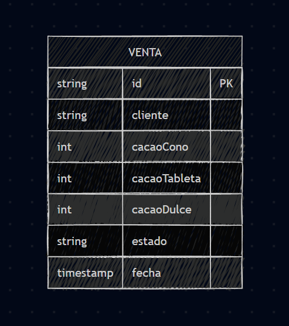
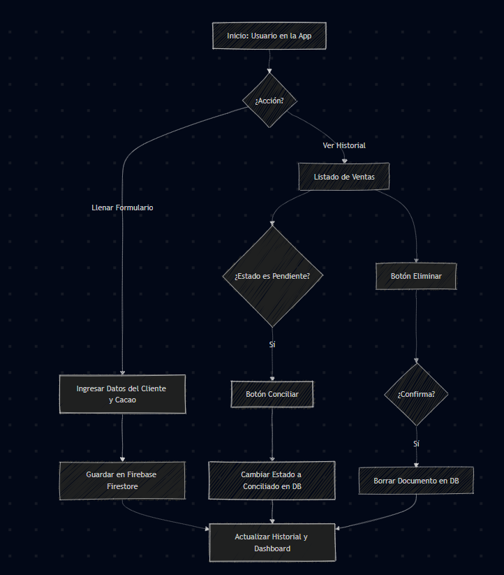
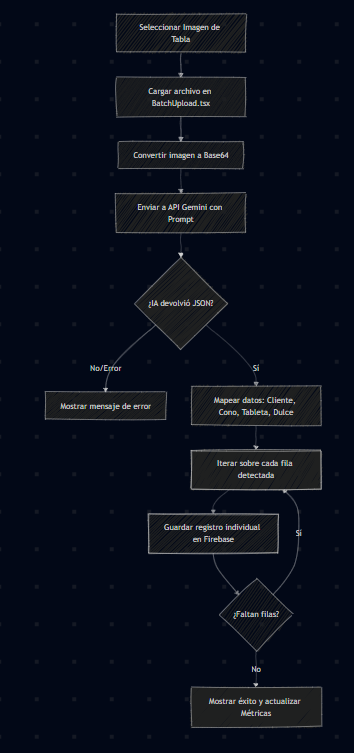

# Universidad Nacional Experimental de Los Llanos Occidentales 
## “Ezequiel Zamora” – UNELLEZ
### Subprograma Ingeniería Y Ciencias Aplicadas - Barinas

---

#  Sistema de Gestión de Ventas y Productos de Cacao Artesanal

Es una solución tecnológica diseñada para transformar la gestión de ventas de emprendimientos artesanales, migrando de procesos manuales propensos a errores hacia un sistema web eficiente y automatizado.

---
## IMPORTANTE: SI QUIERES DESCARGAR Y USAR EL PROYECTO TENDRAS QUE COLOCAR TU PROPIA APY DE GEMINI Y TUS DATOS DE BASE DE DATOS DE FIREBASE.
   ESO SERA EN LOS ARCHIVOS:
   ### // src/components/BatchUpload.tsx
   ### // src/lib/firebase.ts

##  Foco Principal del Proyecto
Desarrollo de una **Aplicación Web Progresiva (PWA)** para gestionar el catálogo de productos de cacao (cacao de taza, cacao dulce, tableta de 50g) y registrar transacciones de venta de forma robusta.

###  Problemática Detectada
* **Búsqueda Lineal:** Verificación manual de pagos digitales contra listas físicas, lo que genera una gran pérdida de tiempo.
* **Riesgo de Error:** La manipulación constante de registros en papel aumenta la probabilidad de omitir pagos pendientes.
* **Retraso Operacional:** Conciliación lenta que impide conocer el flujo de caja real en tiempo real.

###  Objetivos del Sistema
1.  **Automatización:** Entrada de datos rápida para ventas fiadas y verificación ágil de pagos.
2.  **Digitalización Inteligente:** Módulo asistido por **IA** para escanear tablas de registro físicas y convertirlas en datos digitales.
3.  **Gestión de Estados:** Seguimiento preciso del ciclo de cada venta (Pendiente vs. Conciliado).

---

##  Tecnologías Utilizadas

* **Lenguaje:** TypeScript + React (Vite).
* **Base de Datos:** Firebase Firestore (NoSQL en tiempo real).
* **Inteligencia Artificial:** Google Gemini API (modelo gemini-1.5-flash).
* **Gestor de Paquetes:** npm.

---

##  Hoja de Ruta de Desarrollo

| Versión | Foco Principal | Funcionalidad Clave |
| :--- | :--- | :--- |
| **v1.0** | Infraestructura | Conexión con Firebase y creación del formulario de registro. |
| **v1.1** | Visualización | Listado de ventas en tiempo real con sincronización en la nube. |
| **v1.2** | Conciliación | Lógica para marcar pagos como recibidos y cambio de estados. |
| **v2.0** | Dashboard | Métricas visuales de unidades vendidas y montos pendientes. |
| **v3.0** | IA & Batch | Escaneo masivo de registros físicos mediante visión artificial. |

---

##  Versión 1.0: Infraestructura y Registro Base

El desarrollo del Producto Mínimo Viable (MVP) se centró en establecer la base tecnológica y la capacidad de guardar datos en la nube.

| Área | Logro Principal | Archivos Creados |
| :--- | :--- | :--- |
| **Infraestructura** | Configuración del proyecto base y dependencias iniciales. | `package.json`, `tsconfig.json` |
| **Tecnología** | Entorno de desarrollo React + TypeScript con Vite. | `App.tsx` |
| **Base de Datos** | Conexión con Firebase Firestore y parámetros de seguridad. | `src/lib/firebase.ts` |
| **Funcionalidad** | Formulario de registro de ventas funcional. | `src/components/VentaForm.tsx` |
| **Resultado** | Persistencia de datos (cliente, productos, fecha, estado). | `src/components/VentaForm.tsx` |

### Archivos Clave del MVP
1. **src/lib/firebase.ts:** Inicializa la conexión con los servicios de Google Cloud.
2. **src/components/VentaForm.tsx:** Interfaz para el ingreso de nuevas ventas.
3. **src/App.tsx:** Componente raíz que integra el formulario y la vista general.

---
## Estructura de Datos (Firestore)
Colección principal: `ventas`

| Campo | Tipo | Ejemplo | Descripción |
| :--- | :--- | :--- | :--- |
| **cliente** | string | "Carlos" | Nombre del comprador. |
| **fecha** | timestamp | *current date* | Fecha y hora exacta del registro. |
| **cacaoCono** | number | 2 | Cantidad de Cacao de cono (taza). |
| **cacaoTableta** | number | 1 | Cantidad de Cacao de tableta (50g). |
| **cacaoDulce** | number | 0 | Cantidad de Cacao dulce. |
| **estado** | string | "Pendiente" | Estado actual del pago. |


### Ejemplo de Documento en JSON
   ´´´json
{
 "cliente": "Carlos",
 "fecha": "2025-12-05T15:00:00Z",
 "cacaoCono": 0,
 "cacaoTableta": 1,
 "cacaoDulce": 2,
 "estado": "Pendiente"
}
´´´
## Versión 1.1: Visualización en Tiempo Real

El objetivo de esta versión es conseguir una lectura de datos en tiempo real y presentarlos de forma organizada en la interfaz de usuario, completando el ciclo de vida básico de los datos (Registro y Visualización).

| Área | Logro Principal | Archivos Clave |
| :--- | :--- | :--- |
| **Tipado Avanzado** | Se definió la interfaz `Venta` (incluyendo el id del documento) para garantizar la seguridad y consistencia de los datos recuperados. | `src/types/Venta.ts` |
| **Funcionalidad** | Se implementó el componente `VentaList` encargado de la lectura y visualización de datos. | `src/components/VentaList.tsx` |
| **Conexión DB** | Uso de `onSnapshot` (Listener en tiempo real) para suscribirse a la colección ventas y actualizar la tabla automáticamente ante cualquier cambio en Firebase. | `VentaList.tsx` |
| **Interfaz (UI)** | Se creó una tabla que muestra la información de las ventas registradas, incluyendo el cliente, las cantidades de cada producto y el estado actual de la venta. | `VentaList.tsx` y `App.tsx` |

##  Versión 1.2 (Conciliación de Pagos)

Esta versión dota al sistema de la capacidad de gestionar el flujo de caja, permitiendo a los usuarios marcar los pagos como recibidos, pasando de **"Pendiente"** a **"Conciliado"** de forma eficiente y visualmente clara, resolviendo así la problemática de la verificación manual.

| Área | Logro Principal | Archivos Clave |
| :--- | :--- | :--- |
| **Funcionalidad** | Se completó el ciclo básico de datos (Crear, Leer, Actualizar) al implementar la función de actualización. | `src/components/VentaList.tsx` |
| **Lógica de DB** | Se implementó la función `handleConciliarPago` que utiliza `updateDoc` de Firebase para modificar el campo estado de un registro específico (usando el `ventaId`). | `VentaList.tsx` |
| **Interfaz (UI)** | Se añadió la columna "Acciones" a la tabla de ventas. | `VentaList.tsx` |
| **Control de Estado** | Se implementó la lógica condicional para: <br>1) Mostrar un botón "Conciliar" solo si el estado es "Pendiente". <br>2) Aplicar un estilo de fondo verde pastel a la celda cuando el estado es "Conciliado". | `VentaList.tsx` y `src/App.css` (o `index.css`) |


##  Versión 2.0 (Dashboard de Métricas)

En esta etapa se añade una capa de inteligencia de negocio sobre los datos transaccionales, proporcionando al usuario una visión clara e inmediata de su inventario y flujo de caja pendientes de cobro.

| Área | Logro Principal | Archivos Clave |
| :--- | :--- | :--- |
| **Métricas** | Se creó el componente `DashboardMetrics` para el cálculo y visualización de indicadores clave de flujo de caja. | `src/components/DashboardMetrics.tsx` |
| **Lógica de Datos** | Se implementó la lógica para sumar las unidades de producto (Cacao Cono, Tableta, Dulce) basándose en el campo estado (Pendiente o Conciliado). | `DashboardMetrics.tsx` |
| **Visualización** | Se crearon tres tarjetas de resumen que muestran: <br>1) Total de Registros. <br>2) Unidades Pendientes de Pago. <br>3) Unidades Conciliadas. | `DashboardMetrics.tsx` |
| **Tiempo Real** | Se verificó que los valores del dashboard se actualizan instantáneamente cuando una venta es conciliada, demostrando un sistema de métricas en tiempo real. | `DashboardMetrics.tsx` / `App.tsx` |

##  Versión 3.0 (Digitalización de Tablas)

Esta versión transforma la aplicación de ser una herramienta de registro manual a ser una plataforma de digitalización inteligente. Esto reduce drásticamente el tiempo y el error en la transcripción de las grandes tablas de ventas.

| Área | Logro Principal | Archivos Clave |
| :--- | :--- | :--- |
| **Interfaz (UI)** | Se creó el componente `BatchUpload` para manejar la carga de imágenes, proporcionar feedback de estado y ejecutar el proceso de escaneo. | `src/components/BatchUpload.tsx` / `src/App.tsx` |
| **Modelo de Digitalización** | Se utilizó una conexión con la API de Google Gemini (modelo gemini-1.5-flash). | `BatchUpload.tsx` / `package.json` |
| **Procesamiento** | Se implementó la lógica para: <br>1) Convertir la imagen de la tabla a formato Base64. <br>2) Utilizar un Prompt estructurado para instruir a Gemini a analizar la imagen y devolver los datos de las filas (Cliente, Cacao Cono, Tableta, Dulce) en formato JSON estricto. | `BatchUpload.tsx` |
| **Automatización** | Se logró la automatización total del registro. Al subir la imagen, múltiples registros de venta se crean en Firebase y se reflejan inmediatamente en el Historial y el Dashboard. | `BatchUpload.tsx` |
| **Gestión de Entorno** | Se gestionaron los desafíos de la carga de la clave API en el entorno Vite, asegurando la inyección correcta de la clave para el desarrollo. | `vite.config.ts` |

---

##  Flujo de Digitalización con IA
El proceso avanzado de carga masiva sigue estos pasos técnicos:
1.  **Captura:** Se selecciona una imagen de la tabla física.
2.  **Procesamiento:** La imagen se convierte a formato **Base64**.
3.  **Análisis:** Se envía a la **API de Gemini** con un prompt estructurado.
4.  **Estructuración:** La IA devuelve un **JSON estricto** con los datos de cada fila.
5.  **Persistencia:** Los registros se insertan automáticamente en la colección de Firebase.

---

##  Diagramas del Sistema

### 1. Modelo de Datos (Entidad-Relación)



### 2. Flujo de Gestión Manual



### 3. Proceso de IA (Gemini)



## 📺 Video de Demostración

Haz clic en la imagen a continuación para ver el sistema en funcionamiento:

[](https://www.youtube.com/watch?v=TlzNqdOvpMU)

*En este video se muestra el flujo de registro, la conciliación de pagos y la digitalización con IA.*
---

##  Información Académica
* **Subproyecto:** Principio de la Ingeniería de Software.
* **Docente:** Neomar Montilla.
* **Sección:** SP01.
* **Alumno:** Trino Carrisales (Ing. Informática).

**Barinas, 22 de enero del 2026.**


# React + TypeScript + Vite

This template provides a minimal setup to get React working in Vite with HMR and some ESLint rules.

Currently, two official plugins are available:

- [@vitejs/plugin-react](https://github.com/vitejs/vite-plugin-react/blob/main/packages/plugin-react) uses [Babel](https://babeljs.io/) (or [oxc](https://oxc.rs) when used in [rolldown-vite](https://vite.dev/guide/rolldown)) for Fast Refresh
- [@vitejs/plugin-react-swc](https://github.com/vitejs/vite-plugin-react/blob/main/packages/plugin-react-swc) uses [SWC](https://swc.rs/) for Fast Refresh

## React Compiler

The React Compiler is not enabled on this template because of its impact on dev & build performances. To add it, see [this documentation](https://react.dev/learn/react-compiler/installation).

## Expanding the ESLint configuration

If you are developing a production application, we recommend updating the configuration to enable type-aware lint rules:

```js
export default defineConfig([
  globalIgnores(['dist']),
  {
    files: ['**/*.{ts,tsx}'],
    extends: [
      // Other configs...

      // Remove tseslint.configs.recommended and replace with this
      tseslint.configs.recommendedTypeChecked,
      // Alternatively, use this for stricter rules
      tseslint.configs.strictTypeChecked,
      // Optionally, add this for stylistic rules
      tseslint.configs.stylisticTypeChecked,

      // Other configs...
    ],
    languageOptions: {
      parserOptions: {
        project: ['./tsconfig.node.json', './tsconfig.app.json'],
        tsconfigRootDir: import.meta.dirname,
      },
      // other options...
    },
  },
])
```

You can also install [eslint-plugin-react-x](https://github.com/Rel1cx/eslint-react/tree/main/packages/plugins/eslint-plugin-react-x) and [eslint-plugin-react-dom](https://github.com/Rel1cx/eslint-react/tree/main/packages/plugins/eslint-plugin-react-dom) for React-specific lint rules:

```js
// eslint.config.js
import reactX from 'eslint-plugin-react-x'
import reactDom from 'eslint-plugin-react-dom'

export default defineConfig([
  globalIgnores(['dist']),
  {
    files: ['**/*.{ts,tsx}'],
    extends: [
      // Other configs...
      // Enable lint rules for React
      reactX.configs['recommended-typescript'],
      // Enable lint rules for React DOM
      reactDom.configs.recommended,
    ],
    languageOptions: {
      parserOptions: {
        project: ['./tsconfig.node.json', './tsconfig.app.json'],
        tsconfigRootDir: import.meta.dirname,
      },
      // other options...
    },
  },
])
```
